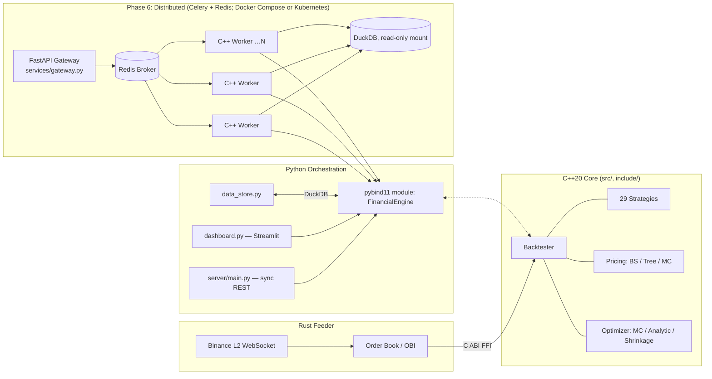

# ⚡ Financial OS

**A polyglot quant trading / derivative-pricing platform** — C++20 core, Python orchestration layer, Rust live-data feeder. Built as a deep engineering exercise (not a "beat the market" pitch): a 6-phase refactor covering testing discipline, architecture decomposition, cross-language FFI, parallel compute, a persistence layer, and a distributed task-queue system, each phase verified by build + tests + preserved golden values before moving to the next.


## What this is

- **C++20 core** (`src/`, `include/`) — event-driven backtester, **29 registered trading strategies** (technical/stat-arb, options/market-making, execution algos, multi-event "suites"), option pricing (Black-Scholes, Binomial Tree, Monte Carlo + variance reduction), portfolio optimization (Monte Carlo, closed-form tangency, Ledoit-Wolf/Bayes-Stein shrinkage). Built as both a static library and a pybind11 module.
- **Python layer** (repo root, `server/`, `services/`, `research/`) — orchestration only, never reimplements engine logic. REST APIs (a synchronous legacy one and an async distributed one), a Streamlit dashboard, data ingestion, demo/validation scripts.
- **Rust feeder** (`market_data_feeder/`) — live market-data process: Binance L2 WebSocket → order-book imbalance → feeds the C++ engine directly over a C-ABI FFI boundary.

## Architecture



## Engineering highlights (measured, not claimed)

| # | Finding | Numbers |
|---|---|---|
| 1 | Backtester hot loop was `O(n²)` (`get_max_drawdown()` rescanned the whole equity curve every tick) — fixed to incremental `O(1)` bookkeeping | 42.9ms → 2.6ms @ 10k bars (**16x**); 1k→10k scaling: 64x → 11x |
| 2 | Parallelized the Optimizer's Monte Carlo loop (map-reduce over a static thread pool, `thread_local` RNG per worker) | **~3.3x** @ 100k trials on an 8-physical-core/16-logical machine — learned to trust wall-clock over `items/sec`, and physical cores over logical |
| 3 | Reproduced DeMiguel et al. (2009) "1/N" result on this engine's own walk-forward harness: closed-form tangency, Ledoit-Wolf Σ-shrinkage, and Bayes-Stein μ-shrinkage all tested OOS | OOS Sharpe: **1/N 1.167** > MC-search 1.106 > min-variance 1.050 ≫ raw tangency 0.073 (440% annualized vol) — every μ-using optimizer lost to naive equal-weight out-of-sample |
| 4 | Distributed the walk-forward evaluation itself via a Celery chord fan-out across a replicated C++ worker pool | worker=1 → **1.183s**, worker=3 → **0.491s** (**2.41x**) on a 42-window job; linear-fit decomposition: ~145ms fixed chord overhead + ~24.7ms/task broker round-trip — the system is currently **orchestration-bound, not compute-bound** (engine compute itself is sub-millisecond) |
| 5 | Translated the Docker Compose stack to Kubernetes (Deployments/Services/HPA for redis+gateway+worker, `k8s/financial-os.yaml`) on a single-node cluster | Verified byte-identical behavior end-to-end through `kubectl port-forward` — same gateway → Redis → 3-replica worker pool → DuckDB path, `SUCCESS` state with matching engine output; surfaced a real constraint (DuckDB's embedded single-file model only tolerates a `hostPath` mount on a single node) that traces back to the Phase 5 storage choice |

See [`ENGINEERING_DECISIONS.md`](./ENGINEERING_DECISIONS.md) for the full story behind each of these — what was assumed, what was measured, and why.

## Repository layout

```
src/, include/        C++20 core — Backtester, Strategy.h (strategy + event catalog), pricing/MC machinery, Optimizer, Bindings.cpp (pybind11 surface)
tests/, benchmarks/    GoogleTest (16 cases) + Google Benchmark
services/              Phase 6 distributed stack: celery_app.py, tasks.py, gateway.py, Dockerfile.{worker,gateway}, tests/ (pytest, 10 cases)
server/                Legacy synchronous FastAPI monolith (data-by-value)
market_data_feeder/    Rust live feeder (Binance L2 → OBI → C++ FFI)
data_store.py          DuckDB persistence layer (pure, no C++ import — testable standalone)
pytests/               pytest suite for data_store.py (12 cases, in-memory DuckDB + monkeypatched yfinance)
docker-compose.yml     redis + gateway + horizontally-scalable worker pool
k8s/                   Kubernetes manifests (redis/gateway/worker Deployments+Services, worker HPA) — alternate deployment target to docker-compose
```

## Build & run

```bash
# C++ core + Python module (fetches googletest/fmt/pybind11/eigen via CMake FetchContent)
cmake -S . -B build -DCMAKE_BUILD_TYPE=Release
cmake --build build
ctest --test-dir build                # 16 GoogleTest cases

# Python entry points (run from repo root; module resolves via ./build/src)
python server/main.py                 # legacy sync REST API on :8000
streamlit run dashboard.py
pytest                                 # 22 pytest cases (scoped via testpaths in pyproject.toml)

# Distributed stack (Phase 6) -- Docker Compose
docker compose up -d --build
docker compose up -d --scale worker=3 # horizontal scale-out, byte-identical to the monolith

# ...or the same stack on Kubernetes (single-node cluster, e.g. minikube)
kubectl apply -f k8s/financial-os.yaml
kubectl get pods -n financial-os -w

# Live microstructure feed (two processes)
cargo run --manifest-path market_data_feeder/Cargo.toml
python live_stream_udp.py
```

## Testing

16 GoogleTest cases (`ctest --test-dir build`), including 5 **characterization / golden-master** tests (`tests/BacktesterCharacterizationTest.cpp`) that pin the Backtester's exact numeric output — 2 price-path strategies (MACD, EMA) and 3 event-driven suites (META_BRAIN, STRUCTURAL_ARB, GLOBAL_MACRO) — so any unintended behavior change during refactoring shows up as a failing test, without asserting the behavior is "correct."

The Python layer has a 22-case pytest suite (`pytest`, scoped via `testpaths` in `pyproject.toml` to `services/tests/` + `pytests/` so it never collides with the root-level `*_test.py` demo scripts, which match pytest's default discovery patterns but are not pytest):
- `services/tests/test_gateway.py` (10 cases) — `_add_months`, `_walkforward_windows`, `_wf_train_test_windows`: the date-window math behind the walk-forward endpoints, and the exact spot where hand-typed bugs (singular/plural `window`/`windows`, a missing leading underscore) turned up earlier in development. Several cases are pinned directly against live-verified runs (19 / 7 / 42 windows).
- `pytests/test_data_store.py` (12 cases) — the DuckDB persistence layer, against an in-memory DB: schema creation, `get_ohlc`/`symbols`/`get_returns_matrix` round-trips, and `ingest`/`ingest_many` with `yf.download` monkeypatched (no real network calls) covering MultiIndex-column flattening, empty-response errors, `ON CONFLICT DO NOTHING` idempotency, and partial-failure partitioning.

The Celery task/worker glue itself is still verified by manual/curl + Docker Compose round-trips rather than integration tests — a known, smaller remaining gap.

## The 6-phase engineering roadmap

| Phase | Focus | Key result |
|---|---|---|
| 1 | Safety net | Golden-master characterization tests, CI, `.clang-format`/`.clang-tidy`, CMake presets |
| 2 | Architecture | Self-registering `StrategyFactory`; decomposed the `Backtester` god-class (`EquityCurve`/`DataHandler`/`Portfolio`); unified 12 event-handler virtuals into one `on_event(std::variant<...>)` |
| 3 | Cross-language + performance | Rust↔C++ C-ABI FFI; Google Benchmark surfaced the `O(n²)` bug (see highlight #1); packaged as an editable-installable pybind11 wheel (scikit-build-core) |
| 4 | Parallel compute | Thread-pooled Monte Carlo optimizer (see highlight #2) |
| 5 | Data + quant research | DuckDB persistence layer; an optimizer-method research arc (MC → closed-form tangency → walk-forward OOS collapse → Ledoit-Wolf → Bayes-Stein) concluding with a reproduction of the "1/N beats MVO" result (see highlight #3) |
| 6 | Distributed systems | Celery + Redis + Docker Compose: async gateway → broker → horizontally-scalable C++ worker pool → by-reference DuckDB; a Celery-chord fan-out for distributed walk-forward (fixed-strategy and adaptive in-sample strategy selection); measured scale-out speedup (see highlight #4); hardening (task-loss-safe acks, targeted retries, health-checked startup ordering, graceful shutdown) |

All 6 phases are complete as of 2026-07-09.

## Beyond the roadmap: further expansion (in progress)

| Item | Status | Notes |
|---|---|---|
| Kubernetes deployment | ✅ done | `k8s/financial-os.yaml` — Deployments/Services/HPA for redis+gateway+worker on a single-node cluster, verified end-to-end (see highlight #5) |
| Observability (Prometheus/Grafana) | planned | |
| `optimize` distributed job type | planned | run the Optimizer (MC/analytic/shrinkage) as a Celery job, alongside the existing backtest/walk-forward jobs |
| Write-side ingestion service | planned | a decoupled write path into the shared DuckDB (workers currently only read via a read-only mount) |
| Large-universe stress test | planned | push distributed walk-forward further to see the C++ engine itself, not orchestration, become the bottleneck |
| CI for the `services/` Docker stack | planned (last) | blocked on an unresolved monorepo issue — `.github/workflows/` currently sits one directory below the actual git root |
